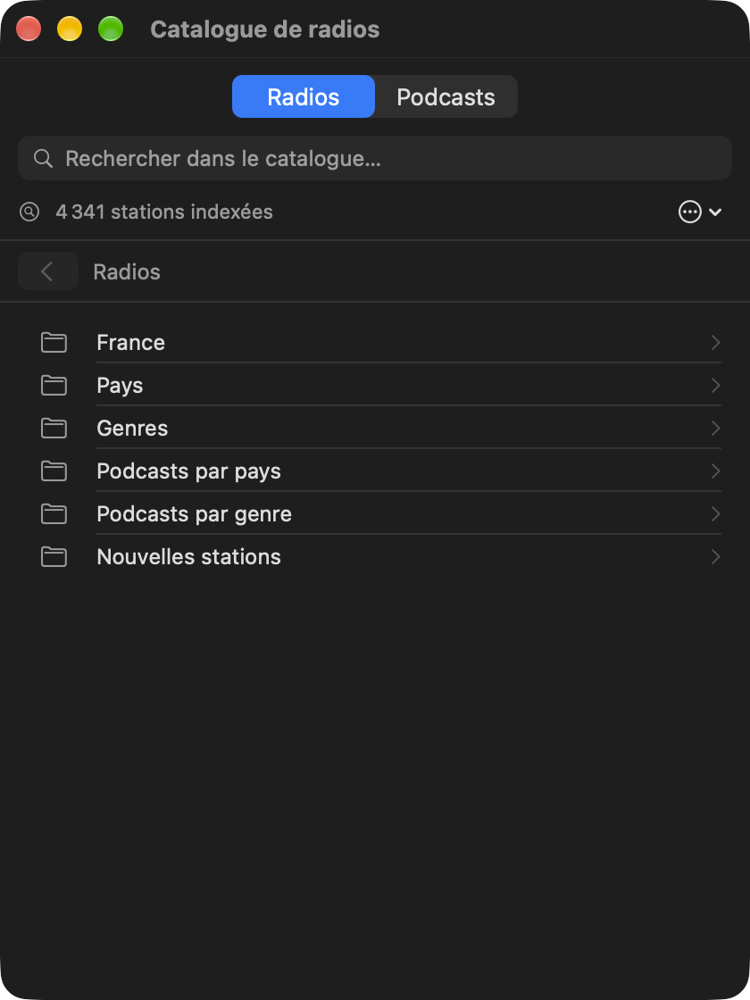
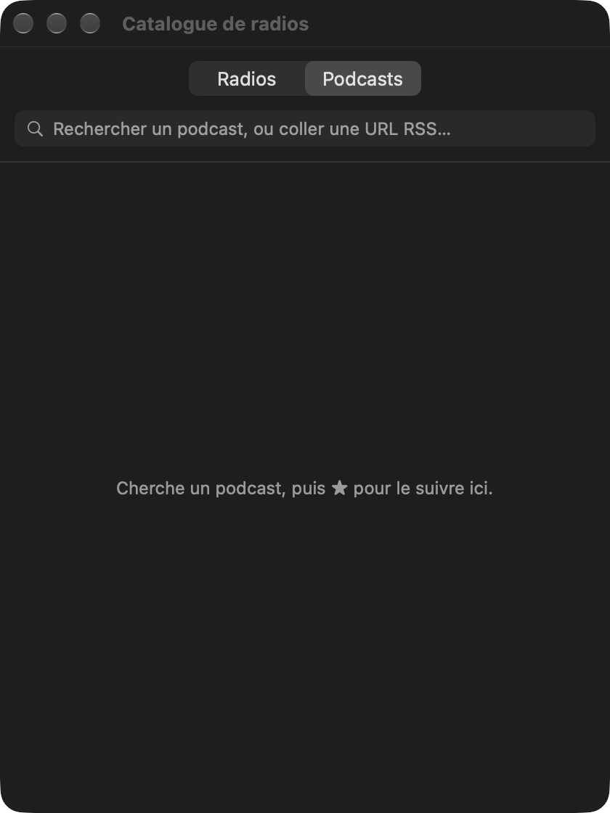
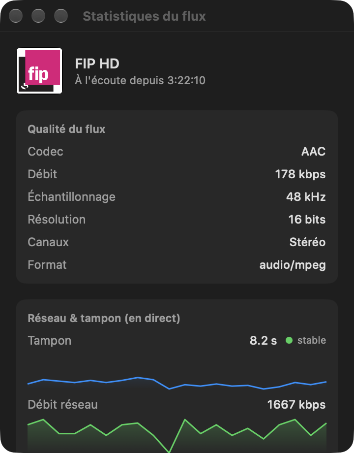

# Sonde

[](https://github.com/gwenn-ha-dev/Sonde/actions/workflows/ci.yml)
[](./LICENSE)


*🇬🇧 [English](./README.md) · 🇫🇷 Français*

Petite app **barre de menu macOS** pour piloter un amplificateur **Cabasse Abyss / AMP 240 S** (plateforme StreamUnlimited, la même électronique que l'app officielle *StreamCONTROL*, mais native, légère et instantanée).


## Fonctionnalités

- **Découverte automatique** de l'ampli sur le réseau (Bonjour `_cabasse-api._tcp`), avec **reconnexion automatique** : si l'ampli redémarre, change d'IP, ou au réveil du Mac, la découverte repart toute seule.
- **Marche / veille** depuis le menu, avec **minuteur de mise en veille** (15/30/60/90 min, compte à rebours affiché, annulable).
- **Now playing temps réel** : titre, fournisseur, pochette, état de lecture, et le morceau en cours quand le flux l'annonce. Lecture/pause, précédent, suivant.
- **Volume et mute** sur un slider 0–100 qui reflète aussi la télécommande physique. La valeur affichée est exactement `rendering_zones[0].volume` — la même que celle de l'app officielle.
- **Plafond de volume réellement appliqué** (activé par défaut à 50). Ce n'est pas un repère sur le slider : la boucle de long-polling surveille l'état de zone et **ramène l'ampli au plafond quelle que soit l'origine du dépassement** — télécommande physique, app officielle, AirPlay, Bluetooth.
- **Loudness mesurée** de chaque station (EBU R128), affichée à côté et jamais corrigée : une station qui joue nettement plus fort est signalée avant qu'on y passe.
- **Grave et aigu**, le profil DEAP de l'enceinte (en lecture seule), la source, et un **volume de démarrage bas**.
- **Favoris** sans la limite des neuf emplacements de l'ampli, filtrés à la frappe.
- Anglais et français, selon la langue du système.
- Aucune dépendance — frameworks Apple uniquement (SwiftUI, Network, URLSession).

| Catalogue | Podcasts |
|---|---|
|  |  |



La fenêtre des statistiques montre ce que l'ampli reçoit vraiment, et si son tampon suit.

## Installation

Téléchargez **`Sonde-<version>.dmg`** depuis la [dernière release](https://github.com/gwenn-ha-dev/Sonde/releases/latest), ouvrez-le et glissez Sonde sur Applications. L'app est signée avec un Developer ID et notarisée par Apple : elle s'ouvre d'un double clic.

Au premier lancement, macOS demande d'autoriser Sonde à trouver des appareils sur le réseau local : acceptez, sans quoi l'ampli ne peut pas être découvert. Sonde n'a pas d'icône dans le Dock ; elle vit dans la barre des menus.

Pour la construire depuis les sources :

```sh
git clone https://github.com/gwenn-ha-dev/Sonde.git
cd Sonde
make build        # construit build/Sonde.app et l'installe dans /Applications
```

`make build` installe dans `/Applications` exprès : macOS accorde la permission Réseau local à une app signée, à un chemin stable, et une app reconstruite ailleurs la perdrait.

## Utilisation

Cliquez l'icône d'enceinte dans la barre des menus. Sonde trouve l'ampli toute seule — le point à côté de son nom passe au vert une fois connectée. Un clic lance un favori, le **Catalogue** cherche une station ou un podcast, et le bouton en forme d'onde à côté de la pochette ouvre les statistiques du flux.

## Comment ça marche

`CabasseClient` parle l'API HTTP de l'ampli sur `http://<hôte>:34000`, sans authentification. L'état est suivi par long polling, ce qui permet au plafond de volume de réagir à un changement qui ne vient pas de cette app. Les médias passent par les services UPnP de l'ampli (ContentDirectory pour parcourir vTuner, AVTransport pour lire un flux). Le type garde le nom `Cabasse` parce qu'il nomme le protocole de l'appareil, pas cette app.

## Construction

| Commande | Ce qu'elle fait |
|---|---|
| `make build` | Compilation release, tout avertissement est une erreur ; installe dans `/Applications` |
| `make test` | Lance la suite de tests |
| `make run` | Lance l'app |
| `make icon` | Régénère `Resources/AppIcon.icns` |
| `make package` | Vérifie `build/Sonde.app`, prête à signer |
| `make sign` | La signe avec un Developer ID, la notarise et l'agrafe |
| `make dmg` | Met l'app notarisée dans un `.dmg` notarisé |
| `make shots` | Refait les captures de `docs/img/` (il faut l'ampli sur le réseau) |
| `make release-check` | Vérifie que `build/` est publiable |
| `make lint` | Vérifie la conformité à la charte du projet |
| `make help` | Liste toutes les cibles |

## Dépendances

Aucune — frameworks Apple uniquement.

## Licence

MIT © 2026 gwenn-ha-dev — voir [LICENSE](./LICENSE).
