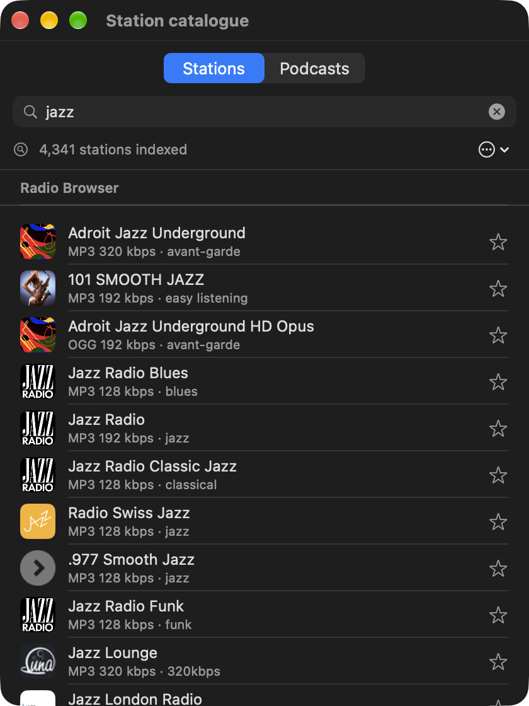
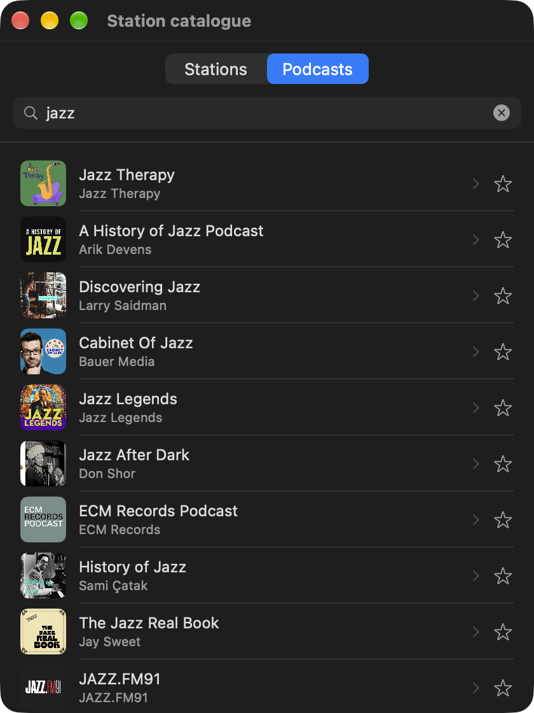
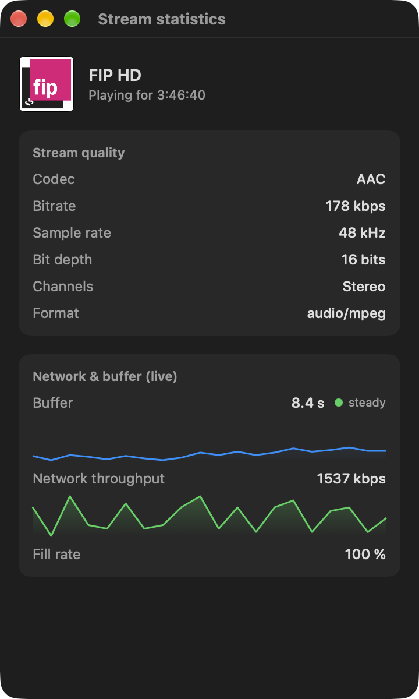

# Sonde

[](https://github.com/gwenn-ha-dev/Sonde/actions/workflows/ci.yml)
[](./LICENSE)


*🇬🇧 English · 🇫🇷 [Français](./README.fr.md)*

A small macOS **menu bar** app that drives a **Cabasse Abyss / AMP 240 S** amplifier (StreamUnlimited platform — the same electronics the official *StreamCONTROL* app talks to, but native, light and instant).


## Features

- **Automatic discovery** on the network (Bonjour `_cabasse-api._tcp`) with **automatic reconnection**: if the amp reboots, changes IP, or the Mac wakes up, discovery restarts on its own.
- **Power / standby** from the menu, with a **sleep timer** (15/30/60/90 min, visible countdown, cancellable).
- **Live now playing**: title, provider, artwork, transport state, and the current song when the stream announces it. Play/pause, previous, next.
- **Volume and mute** on a 0–100 slider that mirrors the physical remote. The displayed value is exactly `rendering_zones[0].volume` — the same number the official app shows.
- **A volume ceiling that is actually enforced** (on by default at 50). Not a mark on the slider: the long-polling loop watches the zone state and **pulls the amp back to the ceiling whatever caused the overshoot** — physical remote, official app, AirPlay, Bluetooth.
- **Measured loudness** of each station (EBU R128), shown next to it and never corrected: a station that plays much louder is flagged before you switch to it.
- **Bass and treble**, the speaker's DEAP profile (read-only), the source, and a **low startup volume**.
- **Favourites** without the amp's nine-slot limit, filtered as you type.
- English and French, following the system language.
- No dependencies — Apple frameworks only (SwiftUI, Network, URLSession).

| Catalogue | Podcasts |
|---|---|
|  |  |



The stream statistics window shows what the amp is actually receiving, and whether its buffer keeps up.

## Install

Download **`Sonde-<version>.dmg`** from the [latest release](https://github.com/gwenn-ha-dev/Sonde/releases/latest), open it and drag Sonde onto Applications. The app is signed with a Developer ID and notarized by Apple: it opens with a double click.

On first launch macOS asks to let Sonde find devices on the local network: allow it, or the amplifier cannot be discovered. Sonde has no Dock icon; it lives in the menu bar.

To build from source instead:

```sh
git clone https://github.com/gwenn-ha-dev/Sonde.git
cd Sonde
make build        # builds build/Sonde.app and installs it in /Applications
```

`make build` installs into `/Applications` on purpose: macOS grants the Local Network permission to a signed app at a stable path, and an app rebuilt elsewhere would lose it.

## Usage

Click the speaker icon in the menu bar. Sonde finds the amplifier by itself — the dot next to its name is green once connected. Play a favourite with one click, open the **Catalogue** to search for a station or a podcast, and the waveform button next to the artwork for the stream statistics.

## How it works

`CabasseClient` speaks the amp's HTTP API on `http://<host>:34000`, unauthenticated. State is followed by long polling, which is why the volume ceiling can react to a change that did not come from this app. Media goes through the amp's UPnP services (ContentDirectory to browse vTuner, AVTransport to play a stream). The type keeps the `Cabasse` name because it names the device protocol, not this app.

## Build

| Command | What it does |
|---|---|
| `make build` | Release build, warnings are errors; installs into `/Applications` |
| `make test` | Run the test suite |
| `make run` | Launch the app |
| `make icon` | Regenerate `Resources/AppIcon.icns` |
| `make package` | Check `build/Sonde.app`, ready to sign |
| `make sign` | Sign it with a Developer ID, notarize and staple it |
| `make dmg` | Pack the notarized app into a notarized `.dmg` |
| `make shots` | Retake the captures in `docs/img/` (needs the amplifier on the network) |
| `make release-check` | Check that `build/` is publishable |
| `make lint` | Check compliance with the project charter |
| `make help` | List every target |

## Dependencies

None — Apple frameworks only.

## License

MIT © 2026 gwenn-ha-dev — see [LICENSE](./LICENSE).
